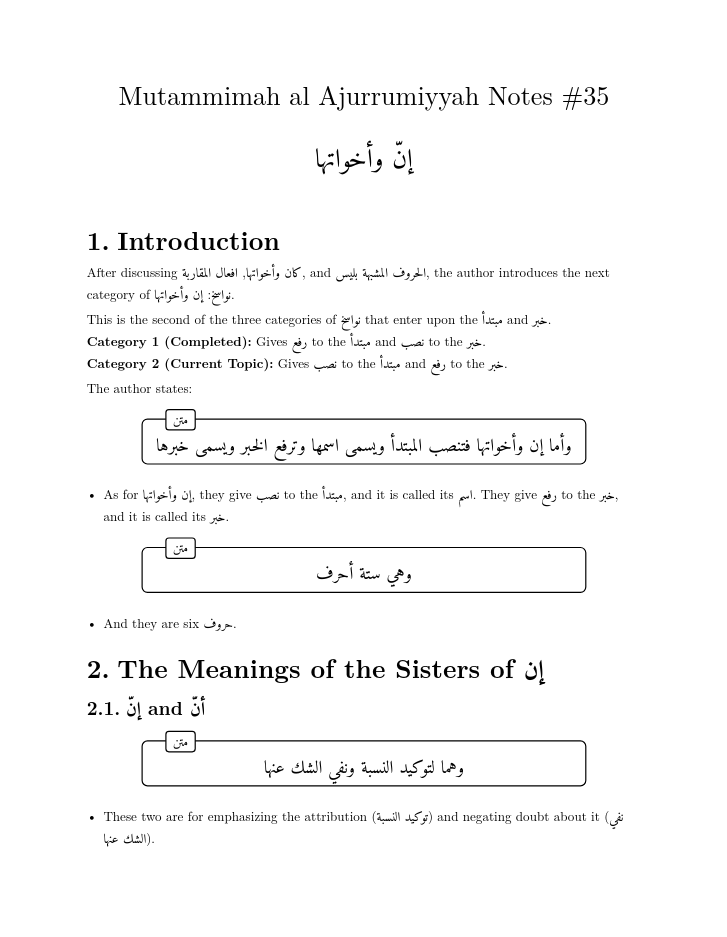

# Arabic Notes Typst Template
A simple Typst template for Arabic-English notes. See ['showcase.pdf'](showcase.pdf) for the rendered PDF usage and see ['example.pdf'](example.pdf) for an example rendered PDF output from my own notes.

## Showcase Images

  
  

## Example Images

  
  

## Usage

### On [typst.app](https://typst.app/)

You can use this easily on the Typst web app by uploading the ['template.typ'](arabic-notes/template.typ) file.

### With [Typst CLI](https://github.com/typst/typst)

Install Typst on your system, then fork and clone this repo and run a command such as 'typst watch showcase.typ'.

To use the package as a local package see [here](https://github.com/typst/packages/blob/main/README.md#local-packages)

Note that this template is intended for use with the Amiri font. If you see Arabic output is rendered differently, you should install the font.
